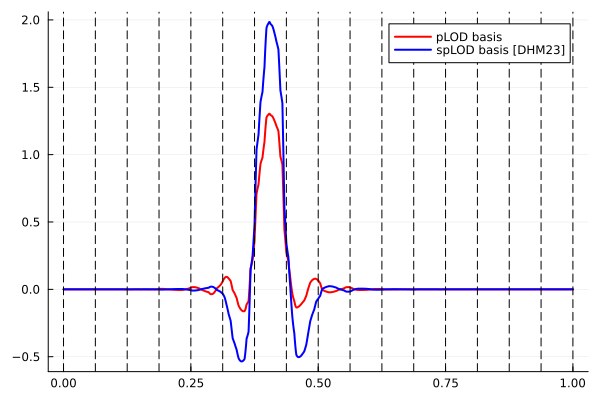
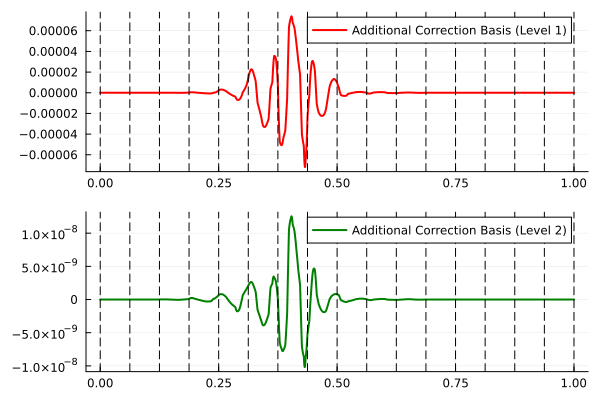
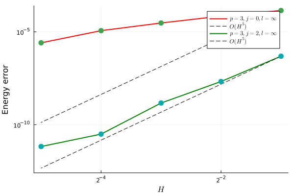

# Multiscale Methods
---

We are interested in developing efficient numerical methods to solve partial 
differential equations with highly oscillatory data. For example, we look at
the wave equation model problem

$$
\begin{align}
  &\partial_t^2 u(x,t) - \nabla \cdot \left(A_{\varepsilon}(x) \nabla u(x,t)\right) = f(x,t), \quad (x,t) \in \Omega \times (0,T],\\
  &u(x,0) = u_0(x), \quad x \in \Omega,\\
  &u = 0, \quad (x,t) \in \partial \Omega \times (0,T].
\end{align}
$$

The diffusion coefficient $$A_{\varepsilon}(x)$$ oscillates at a  fine scale $$\varepsilon \ll 1$$. 
Traditional finite element methods require the mesh size $$h$$ to resolve the underlying oscillation 
scale in order to obtain reasonably accurate approximations of the solution. We are interested in 
developing higher-order multiscale methods that yields a discrete linear system on a coarse mesh (of size $$H \gg h$$)
by constructing spaces with enhanced approximation properties. These bases also have 
a compact support on the domain, potentially resulting in a sparse linear system that is computationally 
tractable and high-order accurate. A brief description of our work so far.

The canonical high-order multiscale bases discussed in (shown in the left panel of the figure below)
> - [DHM23] *Dong, Z., Hauck, M., & Maier, R. (2023).* **An improved high-order method for elliptic multiscale problems.** SIAM Journal on Numerical Analysis, 61(4), 1918-1937.
> - *Maier, R. (2021).* **A high-order approach to elliptic multiscale problems with general unstructured coefficients.** SIAM Journal on Numerical Analysis, 59(2), 1067-1089.

yields suboptimal convergence rates when applied to time dependent PDEs.

In my postdoc at Umeå University, we looked at improving the method by defining suitable *additional correction bases* (shown in the middle panel below) 
on the coarse scale. These bases are then used to expand a time-dependent correction term added to the original 
multiscale solution in order to improve the overall error. We discuss the construction of the bases and prove optimal convergence rates in our papers:
> - *Kalyanaraman, B., Krumbiegel, F., Maier, R., & Wang, S. (2026).* **Enriched higher-order multiscale approaches with applications to wave propagation**. *Submitted* arXiv [Math.NA]. Retrieved from [https://arxiv.org/abs/2605.30118](https://arxiv.org/abs/2605.30118) 
  > - *Kalyanaraman, B., Krumbiegel, F., Maier, R., & Wang, S. (2025).* **Optimal higher-order convergence rates for parabolic multiscale problems**. *Submitted* arXiv [Math.NA]. Retrieved from [https://arxiv.org/abs/2510.09514](https://arxiv.org/abs/2510.09514)

As shown in the right panel below, we observe that the convergence rates are optimal after employing the additional correction terms.

| Multiscale basis functions | Additional correction basis | Convergence rates for the wave equation |
| --- | --- | --- |
|  |  |  |

# Ice Shelf Vibrations
---

Consider an ice-shelf which is assumed to be a two dimensional elastic
body. The ice-shelf is fixed at the landward end $$x=L$$ (right) and free to
vibrate at the seaward end $$x=0$$ (left). Open ocean of depth $$H$$
exists for $$x<0$$ and a cavity region filled with water exists
underneath the ice-shelf $$0<x<L$$. The fluid flow is governed by the
potential flow theory and the vibration of the ice-shelf is governed
by linear-elasticity theory.

  

The objective of the problem is to study the vibrations of the
ice-shelf in response to the waves generated in the open ocean
region. The problem is solved using the finite element method and the
displacement of the ice-shelf are shown in the videos below. The code
is available on [Github](https://github.com/Balaje/iceFem) which was
also published in the Journal of Open Source Software. The video below
compares the vibration of an ice-shelf (modelled as a clamped elastic
body) vs an iceberg (modelled as a free elastic body) subject to the
same incident wave forcing. The semi-infinite boundary in Figure 1 is
treated using a non-local boundary condition defined on the boundary
$$\Gamma_f^{(4)}$$. See the abstract of the
presentation in [34th International Workshop on Water Waves and
Floating Bodies](https://carma.newcastle.edu.au/meetings/iwwwfb/accepted/abstract-0117.pdf)
and also my paper

> *Kalyanaraman, B., Meylan, M. H., Bennetts, L. G., & Lamichhane, B. P. (2020).* **A coupled fluid-elasticity model for the wave forcing of an ice-shelf.** Journal of Fluids and Structures, 97, 103074.

  
  

 

# Gradient Recovery for Virtual Element Methods
---

Gradient recovery methods are popular numerical techniques to
approximate the gradient of the solution. They have super
convergence property and are used in adaptive refinement. Gradient
recovery techniques based on oblique projection are well studied for
the finite element methods.

A gradient recovery technique based on the oblique projection can be
defined for virtual element methods on Polygonal meshes. In the
virtual element setting, the gradient recovery operator projects
$$\nabla u_h$$ by finding $$g_h^k =
\text{Q}_h\left(\frac{\partial u_h}{\partial x_k}\right) \in V_h$$ for
$$k=1,2$$ such that

$$
\begin{equation}
  \sum_{K}\left(\Pi_K^{0}g_h^k, \Pi_K^{0} \mu_j\right)_K =
  \sum_{K}\left(\frac{\partial (\Pi_K^{0} u_h)}{\partial x_k},
    \Pi_K^{0}\mu_j\right)_K.
\end{equation}
$$

with $$(x_1,x_2) = (x,y)$$ and the functions $$\mu_j \in \mathcal{M}_h
:= \text{span}\{\mu_1,\mu_2,\cdots,\mu_N\}$$ satisfy the
bi-orthogonal relation

$$
\begin{equation}
  \left(\Pi^{0}_K \varphi_i, \Pi^{0}_K \mu_j\right)_K = c_j
  \delta_{ij} \quad \forall K \in \mathcal{T}_h.\label{eq:biorth}
\end{equation}
$$

where the scaling factors $$c_j$$ are obtained using mass lumping. We
can observe higher rates of convergence for the gradient which is
shown in the Figure below.

    
  

You can find the
[full article online](https://journal.austms.org.au/ojs/index.php/ANZIAMJ/article/view/14041/2181) published
in the ANZIAM Journal. Do read my [blog
post](./2019/11/02/A-Note-on-Gradient-Recovery.html) on how it can be
made better!! Also, check out [this
repository](https://github.com/Balaje/iVEM) for the MATLAB codes.
